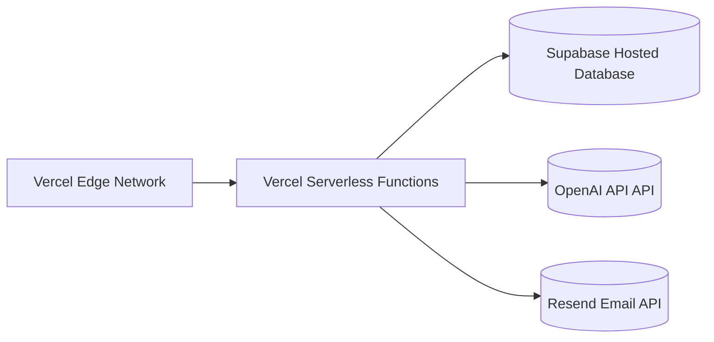

# Deployment & Infrastructure Documentation

InstaVerify-AI utilizes a stateless edge deployment model, meaning there is no persistent monolithic server to maintain. The application scales horizontally by default.

## 1. Hosting Environment
- **Platform:** Vercel
- **Framework Preset:** Next.js
- **Region Allocation:** Deploy to `us-east-1` (or local region) to minimize latency to the Supabase database.

## 2. Infrastructure Diagram



## 3. Deployment Pipeline
The application should be linked to a GitHub repository.
1. Code committed to the `main` branch automatically triggers a Vercel build.
2. Vercel runs `npm run build`, generating statically optimized pages and packaging SSR functions.
3. The build artifact is assigned a unique URL, and if checks pass, it is aliased to the production domains.

## 4. Environment Variables Checklist
The following keys are **strictly required** in the Vercel project settings for the environment to build correctly:

```env
# Supabase Configuration
NEXT_PUBLIC_SUPABASE_URL=https://[YOUR_PROJECT_ID].supabase.co
NEXT_PUBLIC_SUPABASE_ANON_KEY=eyJ...
SUPABASE_SERVICE_ROLE_KEY=eyJ...

# OpenAI Configuration
OPENAI_API_KEY=sk-...

# Application Base URL (Required for auth redirects)
NEXT_PUBLIC_APP_URL=https://insta-verify-ai.vercel.app

# Resend Email Config (Access Requests)
RESEND_API_KEY=re_...
```

*Note on Brevo:* Previously there were `BREVO_SMTP_USER` environment variables instantiated. These remain valid if fallback SMTP logic is written, but the current access system utilizes `RESEND_API_KEY`.
